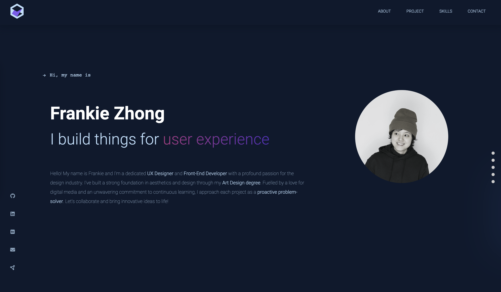

# Frankie Portfolio

 

Welcome to Frankie Portfolio – my inaugural code portfolio web page. This showcase is built on React and includes sections dedicated to introducing myself, highlighting projects, showcasing skills, and detailing my experience. 

## Technologies Used
- **React**
- **Sass**
- **Sanity**
- **GSAP** (GreenSock Animation Platform)
- **Framer Motion**

## Try It Out 
To see the page, visit [Frankie Portfolio](https://frankiezhong-portfolio.netlify.app/). 

## Getting Started 🏁
1. Clone this repository: `git clone https://github.com/your-username/your-repo.git`
2. Install the required dependencies: `npm install`
3. Run the app locally: `npm start`

## Color Reference 
| Color           | Hex      |
| --------------- | -------- |
| Deep Blue       |  #0D192E  |
| Light Blue      | #BBDEFB  |
| Purple          | #815cf0  |
| Grey            | #C5C5C5  |
| Gradient color  | 

 |
| white           | #ffffff  |

Feel free to explore and contribute to this project. If you have any suggestions or find issues, please create a GitHub issue.

